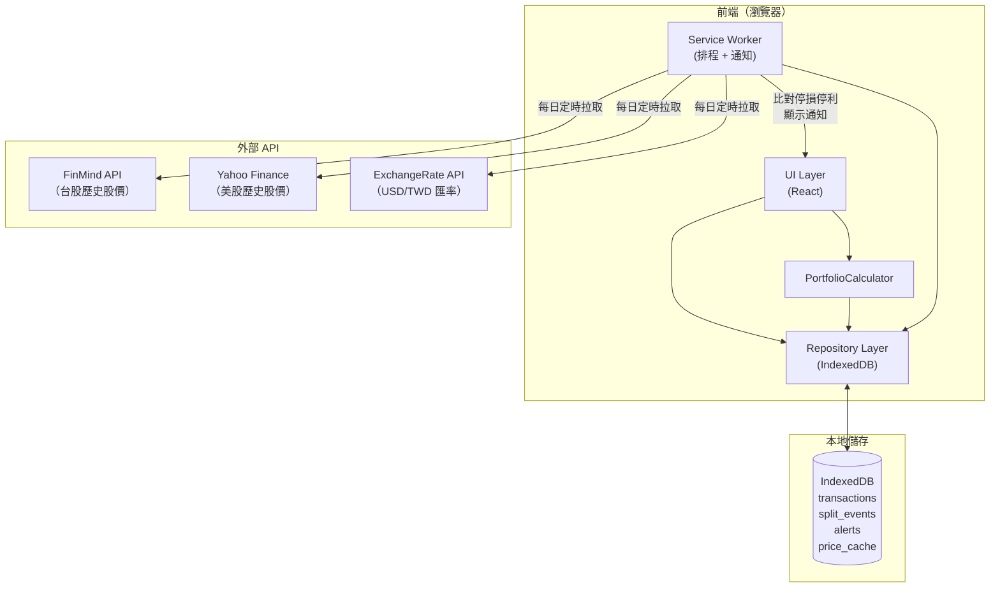
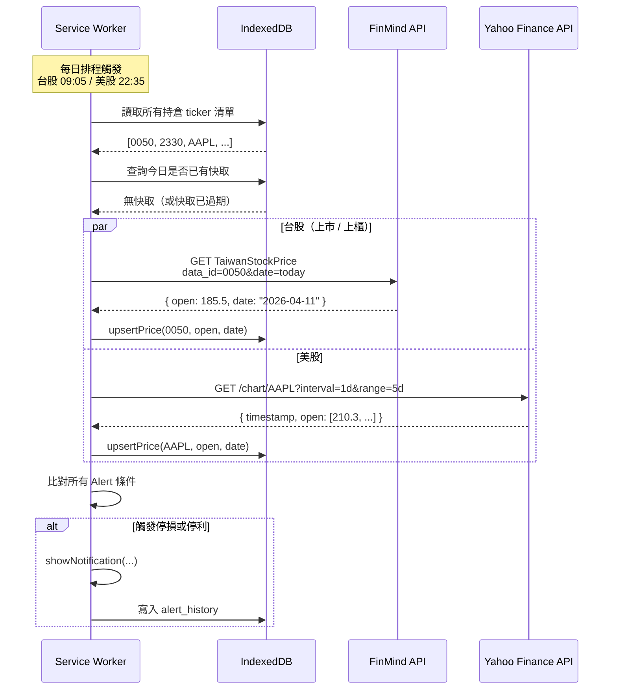
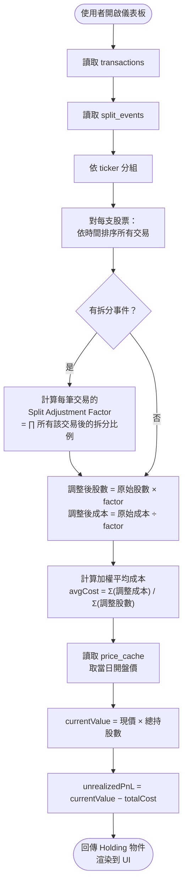
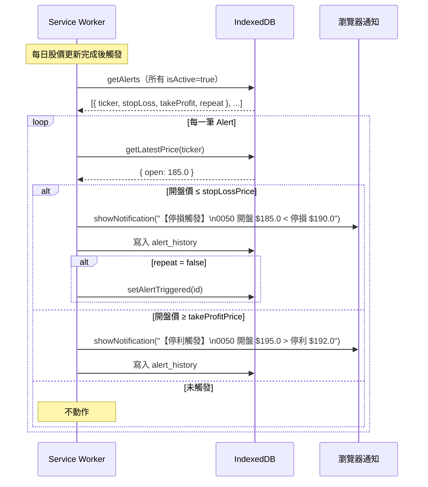

# PRD：股股記 Guguji

**版本：** v1.5  
**日期：** 2026-04-11  
**狀態：** 待審閱

**變更紀錄：**
- v1.5：產品命名為「股股記 Guguji」；補齊 user stories（U8–U14）；修正 1.1 產品定位措辭
- v1.4：新增 3.6 CSV 批次匯入功能規格；移除第 7 章開放問題；更新非功能需求、畫面清單、Phase 規劃、內部 API 規格以反映匯入功能
- v1.3：新增第 10 章外部 API 規格、第 11 章內部 API 規格、第 12 章資料流程圖
- v1.2：OQ1 完成股價 API 來源研究與比較；OQ2 決議為每日一次拉取開盤價，含台美時區處理邏輯；OQ3 決議採 Web Push，補充其他通知可能性；競品新增 Google Finance
- v1.1：移除帳戶/券商欄位（OQ4 決議）；雲端同步保留彈性不綁定方案（OQ5 決議）；移除個股基本財務數據功能，簡化 MVP 範疇（OQ6 決議）

---

## 1. 產品概覽

### 1.1 產品定位

**股股記（Guguji）** 是一款跨平台個人股票資產追蹤工具，支援台股與美股。讓投資人能完整記錄買賣交易、配息配股、股票拆分事件，透過視覺化圖表掌握資產隨時間的變化，並支援停損停利價位通知。資料存於本地，無需帳號，隱私自己管。

### 1.2 目標用戶

有多支台股或美股持倉的個人投資者，需要統一管理與追蹤投資組合表現，但不依賴券商 App（因可能跨多家券商）。

### 1.3 平台

- Web 瀏覽器（主要開發目標）
- iOS App（後續迭代）
- Android App（後續迭代）

### 1.4 MVP 範疇

Phase 1 以 Web 瀏覽器為主，本地資料儲存（IndexedDB / localStorage），不需帳號登入。

---

## 2. 使用者故事

| # | 身份 | 我想要… | 以便… |
|---|------|---------|-------|
| **交易記錄** | | | |
| U1 | 投資人 | 記錄一筆買入交易（含零股） | 追蹤成本與持倉 |
| U2 | 投資人 | 記錄一筆賣出交易並看到實現損益 | 評估投資績效 |
| U3 | 投資人 | 記錄現金股利入帳與配股事件 | 完整計算總報酬 |
| U4 | 投資人 | 編輯或刪除已記錄的交易 | 修正輸入錯誤 |
| U5 | 投資人 | 將歷史交易紀錄批次從 CSV 匯入 | 快速建立初始資料，不用一筆一筆手動輸入 |
| U6 | 投資人 | 下載標準 CSV 匯入範本 | 確認欄位格式，減少匯入錯誤 |
| U7 | 投資人 | 將所有交易紀錄匯出為 CSV | 自行備份或做進一步分析 |
| **資產總覽** | | | |
| U8 | 投資人 | 查看台股、美股各自市值及合計換算 | 掌握整體財富規模 |
| U9 | 投資人 | 查看每支股票及整體投資組合的市值走勢圖（可切換天／週／月等顆粒） | 了解資產隨時間的變化趨勢 |
| U10 | 投資人 | 切換顯示「持倉中」或「已平倉」的股票 | 回顧歷史投資紀錄與損益 |
| **拆分事件** | | | |
| U11 | 投資人 | 系統自動套用台股拆分事件（如 0050 一拆四） | 持倉數量與成本自動調整，不需手動修正 |
| U12 | 投資人 | 手動新增自訂拆分事件 | 處理系統資料庫尚未收錄的個股 |
| **通知** | | | |
| U13 | 投資人 | 設定每支股票的停損／停利價位並收到推播通知 | 開盤時及時得知是否需要採取行動 |
| U14 | 投資人 | 查看歷史通知觸發紀錄 | 回顧哪些停損停利條件曾被觸發 |

---

## 3. 功能規格

### 3.1 交易記錄（Transaction Ledger）

#### 3.1.1 新增買入交易

**必填欄位：**

| 欄位 | 說明 |
|------|------|
| 股票代號 | 台股（如 0050）或美股（如 AAPL） |
| 市場 | 台股 / 美股（系統可由代號自動推斷，允許手動覆蓋） |
| 交易日期 | 日期選擇器，預設今日 |
| 買入價格 | 每股價格，台股以 TWD、美股以 USD 為單位 |
| 買入股數 | 支援小數點（零股，如 0.5 股） |
| 手續費（選填） | 以原幣記錄 |
| 備註（選填） | 自由文字 |

**計算欄位（自動）：**
- 買入總金額 = 價格 × 股數 + 手續費
- 平均成本（加權平均，跨多筆同股票買入自動計算）

#### 3.1.2 新增賣出交易

欄位同買入，額外計算：
- 實現損益（TWD 或 USD）= 賣出金額 − 分攤成本 − 手續費
- 實現損益百分比

賣出後若持股歸零，該股票進入「已平倉」狀態，仍保留歷史紀錄。

#### 3.1.3 新增股利 / 配息事件

| 欄位 | 說明 |
|------|------|
| 股票代號 | 同上 |
| 日期 | 配息入帳日 |
| 類型 | 現金股利 / 股票股利（配股） |
| 金額或股數 | 現金股利填金額；配股填增加股數 |
| 備註 | 選填 |

股票股利入帳後，平均成本自動重新計算（總成本不變，股數增加）。

#### 3.1.4 交易紀錄列表

- 依時間倒序列出所有交易
- 可依股票代號、交易類型篩選
- 支援編輯、刪除（刪除後相關計算自動更新）
- 可匯出為 CSV

---

### 3.2 股票拆分事件（Stock Split）

#### 3.2.1 事件記錄

| 欄位 | 說明 |
|------|------|
| 股票代號 | 如 0050 |
| 生效日期 | 拆分正式生效日 |
| 拆分比例 | 如 4:1（一拆四） |

**範例：** 0050 於 2023-11-01 進行 4:1 拆分  
→ 生效日期後，持股數量 × 4，每股成本 ÷ 4，總資產不變。

#### 3.2.2 處理邏輯

- 系統預設維護一份常見台股拆分事件資料庫（內建，定期更新）
- 使用者也可手動新增自訂拆分事件
- 拆分事件影響：生效日（含）之後的所有持倉計算；生效日之前的歷史交易紀錄不修改原始欄位，但在計算時套用調整係數（Split-Adjusted）

#### 3.2.3 調整係數計算

對於每筆歷史交易：

```
調整後股數 = 原始股數 × ∏(所有該股票在該筆交易之後生效的拆分比例)
調整後成本 = 原始成本 ÷ ∏(同上)
```

---

### 3.3 資產總覽儀表板

#### 3.3.1 總資產卡片

| 區塊 | 說明 |
|------|------|
| 台股持倉總市值 | 以 TWD 顯示 |
| 美股持倉總市值 | 以 USD 顯示 |
| 合計折算 TWD | 依即時匯率換算 |
| 合計折算 USD | 依即時匯率換算 |
| 今日損益 | 與昨收相比（TWD + USD 各自顯示） |
| 總未實現損益 | 現值 − 總成本（含拆分調整） |

匯率來源：自動抓取即時 USD/TWD 匯率，每日更新一次（或用戶手動刷新）。

#### 3.3.2 持倉清單

以表格顯示每支現有持倉：

| 欄位 | 說明 |
|------|------|
| 股票代號 + 名稱 | |
| 市場 | 台股 / 美股 |
| 持股數（拆分調整後） | |
| 平均成本（拆分調整後） | 原幣 |
| 現價 | 當日開盤價（每日一次更新） |
| 現值 | 現價 × 持股數 |
| 未實現損益（金額） | 原幣 |
| 未實現損益（%） | |
| 市值佔比（% of 總投資組合） | |

支援依各欄位排序，可切換顯示「持倉中」或「已平倉」。

#### 3.3.3 資產走勢圖

- X 軸：時間
- Y 軸：總市值（可選 TWD 或 USD 計價）
- 時間顆粒：**日、週、月、季、年**（Tab 切換）
- 時間範圍：1M / 3M / 6M / YTD / 1Y / 3Y / ALL
- 可疊加顯示個別股票的市值走勢（最多同時顯示 5 支）
- 走勢圖數據點以每個時間顆粒的**開盤價**計算

**資料來源策略（OQ1 決議）：**

經研究，以下為可用的台股股價 API 來源比較：

**免費方案**

| 來源 | 歷史資料 | 更新方式 | 限制 | 穩定性 | 備註 |
|------|---------|---------|------|--------|------|
| **TWSE OpenAPI** | ⚠️ 僅當月 | 每日收盤後更新 | 每 5 秒 3 req（超過被封） | 中 | 官方來源；歷史資料需自行每日備份累積；上市股適用，上櫃需搭配 TPEX API |
| **FinMind** | ✅ 2010 年起 | 每日自動更新 | 免費 600 req/hr（需註冊）；1500/hr（登入後） | 高 | 台股＋美股皆有；開源專案；同時提供還原股價（含除權息）；**最推薦** |
| **yfinance（Yahoo Finance 非官方）** | ✅ 20 年以上 | 每日 | 無明確限制，但為非官方爬蟲，偶有中斷風險 | 中低 | 台股代號需加 `.TW`（如 `0050.TW`）；美股直接支援；免費但不穩定 |

**付費方案（若免費方案不滿足）**

| 來源 | 費用 | 歷史資料 | 特色 |
|------|------|---------|------|
| **富果 Fugle API（開發者方案）** | NT$1,499/月 | ✅ 有（2010 年起） | 台灣合規資料源（時報資訊）；REST + WebSocket；穩定度高；同時支援台股及期貨 |
| **富果 Fugle API（進階方案）** | NT$2,999/月 | ✅ 有 | 更高 API 次數上限（2000/min） |
| **富果免費基本方案** | 免費（需富果會員） | ✅ 有（60/min） | 歷史行情 60 req/min 免費；但即時快照不支援 |

**建議策略：**

Phase 1 優先採用 **FinMind 免費方案**（台股）+ **yfinance**（美股）。若 yfinance 穩定性不足，美股升級串接 **Alpha Vantage 免費層**（25 req/day）。若未來用戶規模增長或需要合規資料源，再評估升級 Fugle 付費方案。

---

### 股價拉取排程（OQ2 決議）

**策略：每日一次，拉取當日開盤價，不做盤中即時更新。**

| 市場 | 開盤時間（台灣時間） | 拉取時機 | 說明 |
|------|-----------------|---------|------|
| 台股 | 09:00（GMT+8） | 每日 09:05 | 台股開盤後 5 分鐘拉取開盤價 |
| 美股 | 22:30（GMT+8，夏令）/ 23:30（冬令） | 每日 22:35 / 23:35 | 依美國夏令/冬令時間自動切換 |

**實作細節：**
- Web 版以 Service Worker 定時任務或使用者開啟 App 時觸發補拉（若當日尚未拉取）
- 若當日為非交易日（台股假日、美股假日），跳過該市場；系統內建交易日曆
- 停損停利通知亦以當日開盤價作為判斷依據，非盤中即時價

---

### 3.4 個股詳情頁

進入任一持倉後顯示：

#### 3.4.1 持倉摘要

- 持股數、平均成本、現值、未實現損益
- 所有買入/賣出/配息/拆分事件的時間軸

#### 3.4.2 個股走勢圖

- 同儀表板走勢圖邏輯，但僅顯示該股市值
- 可疊加顯示「買入」「賣出」標記點

---

### 3.5 停損停利通知

#### 3.5.1 設定頁

每支持倉股票可設定：

| 欄位 | 說明 |
|------|------|
| 停損價（選填） | 低於此價格時通知 |
| 停利價（選填） | 高於此價格時通知 |
| 通知方式 | 見 3.5.3 |
| 通知重複 | 僅通知一次 / 每日提醒（直到手動關閉） |

#### 3.5.2 觸發邏輯

- 每日開盤後拉取開盤價時自動比對所有設定條件（台股 09:05、美股 22:35/23:35 台灣時間）
- 觸發後發送推播通知，訊息格式：  
  `【停損觸發】0050 今日開盤價 NT$185.0，已低於停損價 NT$190.0`
- 觸發後自動標記為「已觸發」，避免重複通知（除非設定重複提醒）
- 使用者可從通知清單查看歷史觸發紀錄

#### 3.5.3 通知方式（OQ3 決議）

**Phase 1 採用：Web Push Notifications**
- 標準 Web Push API，使用者需在瀏覽器授權通知權限
- 透過 Service Worker 在背景接收推播，即使 App 未開啟也能收到
- 支援 Chrome、Edge、Firefox（Safari 桌面版自 macOS Ventura 起支援）
- iOS Safari 自 iOS 16.4 起支援 PWA Web Push

**其他可能性（Phase 2 / 未來評估）：**

| 方案 | 優點 | 缺點 |
|------|------|------|
| App 原生推播（APNs / FCM） | 最可靠；iOS/Android 皆支援 | 需開發原生 App |
| Email 通知 | 無需任何權限 | 即時性差 |
| LINE Messaging API | 台灣用戶普及率高 | 需申請 LINE 官方帳號；有 API 費用 |
| Telegram Bot | 免費、可靠 | 需用戶有 Telegram 帳號 |

---

### 3.6 CSV 批次匯入

#### 3.6.1 功能概述

允許使用者將現有歷史交易紀錄以 CSV 檔案批次匯入系統，加速初始資料建立。App 提供標準範本下載，使用者依範本填寫後上傳。

#### 3.6.2 CSV 範本規格

**範本下載：** 設定頁提供「下載匯入範本」按鈕，產生 `import_template.csv`。

**欄位定義：**

| 欄位名稱 | 必填 | 型別 | 說明 | 範例 |
|---------|------|------|------|------|
| `date` | ✅ | string | 交易日期，格式 `YYYY-MM-DD` | `2024-03-15` |
| `ticker` | ✅ | string | 股票代號 | `0050`、`AAPL` |
| `market` | ✅ | string | `TW` 或 `US` | `TW` |
| `type` | ✅ | string | `buy`、`sell`、`dividend`、`stock_dividend` | `buy` |
| `price` | ✅ | number | 每股價格（原幣，無逗號） | `185.5` |
| `shares` | ✅ | number | 股數（支援小數） | `100`、`0.5` |
| `fee` | ❌ | number | 手續費（原幣），無則留空或填 `0` | `30` |
| `note` | ❌ | string | 備註，可留空 | `定期定額` |

**範本範例（CSV 內容）：**

```csv
date,ticker,market,type,price,shares,fee,note
2024-01-15,0050,TW,buy,148.50,100,30,定期定額
2024-03-01,AAPL,US,buy,182.30,5,0,
2024-06-15,0050,TW,dividend,3.40,100,,2023年下半年股利
2024-09-20,0050,TW,sell,165.00,50,25,停利出場
```

**格式注意事項（範本內附說明）：**
- 日期格式須為 `YYYY-MM-DD`
- `type` 為現金股利時，`price` 填每股配息金額、`shares` 填持股數
- `type` 為股票股利（`stock_dividend`）時，`price` 填 `0`、`shares` 填新增股數
- 數字欄位不可含逗號（如 `1,000` 須寫為 `1000`）
- 第一列為欄位標題列，不可刪除

#### 3.6.3 匯入流程

```
1. 使用者於「設定」頁面點擊「匯入交易紀錄」
2. 選擇 CSV 檔案（.csv，上限 5MB）
3. 系統解析並驗證所有列
4. 顯示預覽畫面（含驗證結果）
5. 使用者確認後執行匯入
```

#### 3.6.4 驗證規則

匯入前對每一列執行以下檢查：

| 驗證項目 | 錯誤條件 |
|---------|---------|
| 必填欄位 | 任何必填欄位為空白 |
| 日期格式 | 非 `YYYY-MM-DD` 格式，或非合法日期（如 2024-02-30） |
| market 值 | 非 `TW` 或 `US` |
| type 值 | 非 `buy`、`sell`、`dividend`、`stock_dividend` |
| price | 非數字，或 ≤ 0（stock_dividend 例外，允許 0） |
| shares | 非數字，或 ≤ 0 |
| fee | 非數字，或 < 0 |
| 賣出股數 | sell 的股數超過該股票截至交易日的持倉量（需跨列計算） |

**驗證失敗處理（整批失敗策略）：**

若任意一列驗證失敗，**整批 CSV 全部不匯入**，顯示錯誤摘要：

```
匯入失敗，共發現 3 個錯誤，請修正後重新上傳：

第 4 列：date 格式錯誤（"2024/3/1" 應為 "2024-03-01"）
第 7 列：type 值無效（"BUY" 應為小寫 "buy"）
第 12 列：price 不可為空白
```

#### 3.6.5 重複偵測與處理

**重複定義：** 同一筆記錄的 `date`、`ticker`、`market`、`type`、`price`、`shares` 完全相同，且系統中已存在相同資料。

**處理流程：** 驗證通過後、正式匯入前，系統比對現有資料庫，若偵測到重複：

```
發現 2 筆可能重複的交易，請選擇如何處理：

① 2024-01-15  0050  買入  148.50 × 100 股
② 2024-06-15  0050  股利  3.40 × 100 股

[略過重複，僅匯入其餘 X 筆]   [全部匯入（包含重複）]   [取消]
```

使用者選擇後才執行最終匯入。

#### 3.6.6 匯入結果

匯入完成後顯示摘要通知：

```
匯入成功！共新增 47 筆交易紀錄（略過 2 筆重複）
```

匯入後系統立即重新計算所有持倉，儀表板數據自動刷新。

---

## 4. 資料架構（本地儲存）

使用 **IndexedDB** 作為本地儲存，規劃以下資料表：

### transactions（交易記錄）

```
id, ticker, market, type(buy/sell/dividend/stock_dividend),
date, price, shares, fee, note, created_at
```

### split_events（拆分事件）

```
id, ticker, market, effective_date, ratio_from, ratio_to,
source(built_in/user), created_at
```

### alerts（停損停利設定）

```
id, ticker, market, stop_loss_price, take_profit_price,
notify_type, repeat, is_active, created_at
```

### alert_history（觸發紀錄）

```
id, alert_id, ticker, trigger_type(stop_loss/take_profit),
trigger_price, triggered_at
```

### price_cache（股價快取）

```
ticker, market, price, price_date, updated_at
```

---

## 5. 非功能需求

| 類別 | 需求 |
|------|------|
| 效能 | 儀表板首次載入 < 3 秒（不含股價 API 回應時間） |
| 離線使用 | 無網路時可查看快取的最後股價及所有本地資料 |
| 資料安全 | 所有資料儲存於使用者本地，不上傳伺服器（Phase 1） |
| 匯出／匯入 | 交易紀錄支援匯出與匯入 CSV；匯入支援範本下載、整批驗證與重複偵測 |
| 無障礙 | 圖表需提供數值 tooltip，配色考量色盲友善 |

---

## 6. 畫面清單

| 畫面 | 說明 |
|------|------|
| 儀表板（首頁） | 總資產卡片 + 持倉清單 + 走勢圖 |
| 個股詳情 | 持倉摘要 + 走勢圖 + 交易時間軸 |
| 新增交易 | 表單（買入/賣出/配息/配股 Tab 切換） |
| 交易紀錄列表 | 全部交易的篩選與列表 |
| 拆分事件管理 | 內建事件列表 + 自訂事件新增 |
| 停損停利設定 | 每支股票的通知設定 |
| 通知歷史 | 已觸發通知的列表 |
| 設定 | 預設計價幣別、匯率更新、資料匯出／匯入（含範本下載、上傳 CSV） |

---

## 7. 開發優先級（Phase 規劃）

### Phase 1（MVP，Web）

1. 交易記錄 CRUD（買入、賣出、配息、配股）
2. **CSV 批次匯入**（含範本下載、整批驗證、重複偵測）
3. 持倉計算（加權平均成本、未實現損益）
4. 股票拆分事件處理（內建常見台股拆分事件）
5. 儀表板（持倉清單 + 總資產）
6. 基本走勢圖（依現價 × 持倉量，歷史資產估算）
7. CSV 匯出

### Phase 2（功能完善，Web）

8. 停損停利通知（Web Push）
9. 個股詳情頁（持倉摘要 + 走勢圖 + 交易時間軸）
10. 匯率自動更新
11. 走勢圖歷史數據精確化（串接歷史股價 API）

### Phase 3（跨平台）

12. iOS App
13. Android App
14. App 推播通知
15. 雲端同步（選用）

---

## 9. 競品參考

| 產品 | 優點 | 缺點 |
|------|------|------|
| Goodinfo（台股） | 財務數據齊全 | 不支援美股、無投資組合追蹤功能 |
| Google Finance | 跨市場、介面簡潔、免費 | 無買入成本記錄、無損益計算、無拆分事件處理、功能極簡 |
| Stock Events（App） | UI 好看、含除息事件 | 無台股拆分處理、付費 |
| Portfolio Performance（桌面） | 功能完整 | 操作複雜、無行動版 |
| Yahoo Finance 投資組合 | 跨市場 | 無法記錄零股、拆分處理不穩定 |

---

## 10. 外部 API 規格

### 10.1 台股股價：FinMind API

**Base URL：** `https://api.finmindtrade.com/api/v4/data`  
**認證：** Query parameter `token`（免費方案須先至官網註冊取得）

#### 10.1.1 取得個股每日股價

```
GET https://api.finmindtrade.com/api/v4/data
  ?dataset=TaiwanStockPrice
  &data_id={ticker}
  &start_date={YYYY-MM-DD}
  &end_date={YYYY-MM-DD}
  &token={API_TOKEN}
```

**路徑參數：**

| 參數 | 型別 | 說明 |
|------|------|------|
| `dataset` | string | 固定值 `TaiwanStockPrice` |
| `data_id` | string | 台股代號，如 `0050`、`2330` |
| `start_date` | string | 起始日 `YYYY-MM-DD` |
| `end_date` | string | 結束日 `YYYY-MM-DD` |
| `token` | string | API Token（免費用戶 600 req/hr） |

**Response 範例：**

```json
{
  "msg": "success",
  "status": 200,
  "data": [
    {
      "date": "2024-01-02",
      "stock_id": "0050",
      "Trading_Volume": 5234123,
      "Trading_money": 892345678,
      "open": 145.5,
      "max": 147.0,
      "min": 145.0,
      "close": 146.8,
      "spread": 1.3,
      "Trading_turnover": 12345
    }
  ]
}
```

**App 使用欄位：** `date`、`open`（開盤價）、`stock_id`

**Rate Limit：** 免費（需 token）600 req/hr；登入後 1,500 req/hr

---

#### 10.1.2 取得台股拆分事件

```
GET https://api.finmindtrade.com/api/v4/data
  ?dataset=TaiwanStockSplitDividend
  &data_id={ticker}
  &start_date={YYYY-MM-DD}
  &token={API_TOKEN}
```

**Response 欄位：** `date`（生效日）、`stock_id`、`before_split_shares`、`after_split_shares`

> 用途：補充比對 App 內建拆分事件資料庫，確保資料完整性。

---

### 10.2 美股股價：yfinance（非官方 Yahoo Finance）

**套件：** `yfinance` Python library 或透過前端直接呼叫 Yahoo Finance Query API

**前端直接呼叫（無需後端）：**

```
GET https://query1.finance.yahoo.com/v8/finance/chart/{ticker}
  ?interval=1d
  &range={range}
```

| 參數 | 範例值 | 說明 |
|------|--------|------|
| `ticker` | `AAPL`、`MSFT` | 美股代號 |
| `interval` | `1d` | 每日資料 |
| `range` | `1y`、`2y`、`5y`、`max` | 歷史範圍 |

**Response 關鍵欄位（位於 `chart.result[0]`）：**

```json
{
  "timestamp": [1704153600, ...],
  "indicators": {
    "quote": [{
      "open":  [185.0, 186.2, ...],
      "close": [185.5, 187.0, ...]
    }]
  }
}
```

**App 使用欄位：** `timestamp`（轉換為日期）、`open`

**注意：** 此為非官方 endpoint，Yahoo 未公開保證穩定性；CORS 限制在前端直接呼叫可能需要 Proxy。

---

### 10.3 匯率：ExchangeRate API

**來源：** `https://open.er-api.com/v6/latest/USD`（免費，每日更新）

```
GET https://open.er-api.com/v6/latest/USD
```

**Response：**

```json
{
  "result": "success",
  "base_code": "USD",
  "rates": {
    "TWD": 32.15,
    "USD": 1.0
  },
  "time_last_update_utc": "Sat, 11 Apr 2026 00:00:01 +0000"
}
```

**App 使用欄位：** `rates.TWD`（USD → TWD 匯率）、`time_last_update_utc`

**Rate Limit：** 免費方案每月 1,500 次請求（每日一次更新對本專案完全足夠）

---

### 10.4 Web Push 通知

**規範：** W3C Web Push Protocol + VAPID 認證

**流程：**

1. App 向瀏覽器請求通知授權（`Notification.requestPermission()`）
2. Service Worker 向瀏覽器取得 Push Subscription（含 `endpoint`、`keys`）
3. Subscription 儲存於 IndexedDB
4. Service Worker 定時任務觸發時，在本地比對股價與停損停利條件
5. 符合條件時由 Service Worker 直接呼叫 `self.registration.showNotification()`

> **Phase 1 採全本地通知**：不需後端推播伺服器，Service Worker 在本地判斷後直接顯示通知，無需 VAPID Server。此方式的限制是瀏覽器需開啟（或至少有 Service Worker 在背景運行）才能觸發。

---

## 11. 內部 API 規格（IndexedDB 操作層）

前端以統一的 Repository 模式封裝 IndexedDB 操作，各模組透過以下函式存取資料。

### 11.1 TransactionRepository

```typescript
// 新增交易
addTransaction(tx: Transaction): Promise<string>          // 回傳新 id

// CSV 批次匯入
importTransactions(params: {
  rows: ParsedImportRow[]           // 已解析的 CSV 列
  skipDuplicates: boolean           // 使用者選擇略過或全部匯入
}): Promise<ImportResult>

interface ParsedImportRow {
  date: string; ticker: string; market: 'TW' | 'US'
  type: 'buy' | 'sell' | 'dividend' | 'stock_dividend'
  price: number; shares: number; fee: number; note: string
}

interface ImportResult {
  inserted: number        // 成功新增筆數
  skipped: number         // 略過重複筆數
  errors: ImportError[]   // 驗證錯誤（整批失敗時非空）
}

interface ImportError {
  row: number             // CSV 列號（從 2 起，排除標題列）
  field: string           // 問題欄位
  message: string         // 錯誤說明
}

// 查詢
getTransactions(filter?: {
  ticker?: string
  market?: 'TW' | 'US'
  type?: 'buy' | 'sell' | 'dividend' | 'stock_dividend'
  dateFrom?: string   // YYYY-MM-DD
  dateTo?: string
}): Promise<Transaction[]>

// 更新 / 刪除
updateTransaction(id: string, patch: Partial<Transaction>): Promise<void>
deleteTransaction(id: string): Promise<void>

// 匯出
exportToCSV(): Promise<string>  // 回傳 CSV 字串
```

**Transaction 型別：**

```typescript
interface Transaction {
  id: string               // UUID
  ticker: string           // 如 '0050', 'AAPL'
  market: 'TW' | 'US'
  type: 'buy' | 'sell' | 'dividend' | 'stock_dividend'
  date: string             // YYYY-MM-DD
  price: number            // 每股價格（原幣）
  shares: number           // 股數（支援小數）
  fee: number              // 手續費（原幣），無則為 0
  note: string
  createdAt: string        // ISO 8601
}
```

---

### 11.2 PortfolioCalculator

計算層，不直接操作 IndexedDB，接收 transactions 與 splitEvents 後回傳計算結果。

```typescript
// 計算單支股票的當前持倉
calcHolding(
  ticker: string,
  transactions: Transaction[],
  splitEvents: SplitEvent[]
): Holding

// 計算所有持倉
calcAllHoldings(
  transactions: Transaction[],
  splitEvents: SplitEvent[]
): Holding[]

// 計算歷史每日市值（用於走勢圖）
calcDailyPortfolioValue(
  transactions: Transaction[],
  splitEvents: SplitEvent[],
  prices: PriceRecord[],        // 來自 price_cache
  fxRate: number                // USD→TWD
): DailyValue[]
```

**Holding 型別：**

```typescript
interface Holding {
  ticker: string
  market: 'TW' | 'US'
  shares: number             // 拆分調整後股數
  avgCost: number            // 拆分調整後加權平均成本（原幣）
  totalCost: number          // 總投入成本（原幣）
  currentPrice: number       // 今日開盤價
  currentValue: number       // currentPrice × shares
  unrealizedPnL: number      // currentValue − totalCost
  unrealizedPnLPct: number   // unrealizedPnL / totalCost
  realizedPnL: number        // 已平倉部分累計損益
}
```

---

### 11.3 SplitEventRepository

```typescript
addSplitEvent(event: SplitEvent): Promise<string>
getSplitEvents(ticker?: string): Promise<SplitEvent[]>
deleteSplitEvent(id: string): Promise<void>

interface SplitEvent {
  id: string
  ticker: string
  market: 'TW' | 'US'
  effectiveDate: string    // YYYY-MM-DD
  ratioFrom: number        // 拆分前，如 1
  ratioTo: number          // 拆分後，如 4（1拆4）
  source: 'built_in' | 'user'
}
```

---

### 11.4 AlertRepository

```typescript
upsertAlert(alert: Alert): Promise<void>
getAlerts(ticker?: string): Promise<Alert[]>
setAlertTriggered(id: string): Promise<void>
getAlertHistory(): Promise<AlertHistory[]>

interface Alert {
  id: string
  ticker: string
  market: 'TW' | 'US'
  stopLossPrice: number | null
  takeProfitPrice: number | null
  repeat: boolean
  isActive: boolean
  createdAt: string
}
```

---

### 11.5 PriceCacheRepository

```typescript
upsertPrice(record: PriceRecord): Promise<void>
getLatestPrice(ticker: string): Promise<PriceRecord | null>
getPriceHistory(ticker: string, from: string, to: string): Promise<PriceRecord[]>

interface PriceRecord {
  ticker: string
  market: 'TW' | 'US'
  date: string          // YYYY-MM-DD
  open: number
  updatedAt: string
}
```

---

## 12. 資料流程圖

> 以下流程圖以 Mermaid 語法撰寫，另附獨立 `.mermaid` 檔可直接渲染。

### 12.1 系統整體架構



---

### 12.2 每日股價更新流程



---

### 12.3 持倉計算流程（含拆分調整）



---

### 12.4 停損停利通知流程



---

*本 PRD 由 Claude 協助撰寫，請與相關利害關係人確認後定版。*

